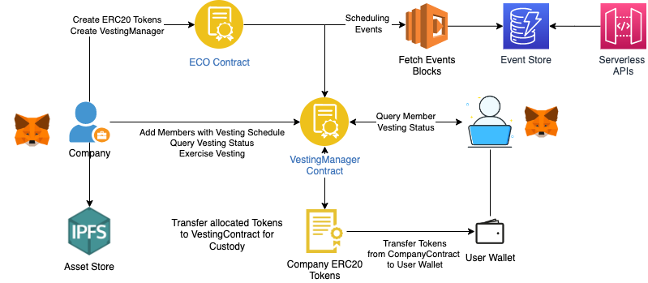

# ECO DApp
Solidity DApp to Share Company Coins to Employees with Periodic Vesting Mechanism



## Quick start

The first things you need to do are cloning this repository and installing its
dependencies:

```sh
git clone https://github.com/dhavaln/eco-dapp.git
cd eco-dapp
npm install
```

Once installed, run Hardhat's testing network:

```sh
npx hardhat node
```

Then, open a new terminal, go to the repository's root folder and run this to
deploy your smart contracts:

```sh
npx hardhat run scripts/deploy.js --network localhost
```

Test the contracts locally first:

```sh
npx hardhat test
```

Finally, we can run start the frontend with:

```sh
cd frontend
npm install
npm start
```

> Make sure you have added the local network in your MetaMask wallet.
> You will need to have [Metamask](https://metamask.io) installed and listening to
`localhost 8545`.

Open [http://localhost:3000/](http://localhost:3000/) to this working.
